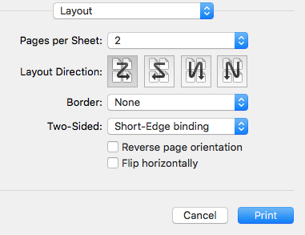

# PDF Booklet

OS X / macOS command line utility to reorder pages in a PDF file for booklet printing.

pdfbooklet copies pages from a pdf file to a new pdf file in an order appropriate for booklet 
printing. If the number of pages in the input file is not a multiple of 4, empty pages get inserted.
The inserted pages have the same size as the first page.

Order of pages in the output:

- last page
- first page
- second page
- second-last page
- third-last page
- third page
- fourth page
- ...

Print layout settings to use for the newly created PDF:

- Pages per Sheet: 2
- Layout direction: 1st option (looks like a Z) or 3rd option (looks like mirrored N)
- Two-Sided: Short-Edge binding

## Runtime Requirements

OS X 10.9 (Mavericks), OS X 10.10 (Yosemite), OS X 10.11 (El Capitan), or macOS 10.12 (Sierra).

## Install via [Homebrew](http://brew.sh)

Once pdfbooklet becomes available in homebrew, you can simply install it by executing:

		brew install pdfbooklet

## Build and Install from Source

There are no extra requirements except Xcode.

To build from command line simply run `xcodebuild` in the project root folder. If you prefer to
use the Xcode IDE, open `pdfbooklet.xcproject` and choose `Build` from the `Product` Menu. 

Installation steps:

- Copy the `pdfbooklet` executable to /usr/local/bin/
- Copy the `pdfbooklet.1` man page to /usr/local/share/man/man1/

Alternatively you can also invoke `xcodebuild install DSTROOT=/` to build and install the executable
in one step. This does not install the man page.
